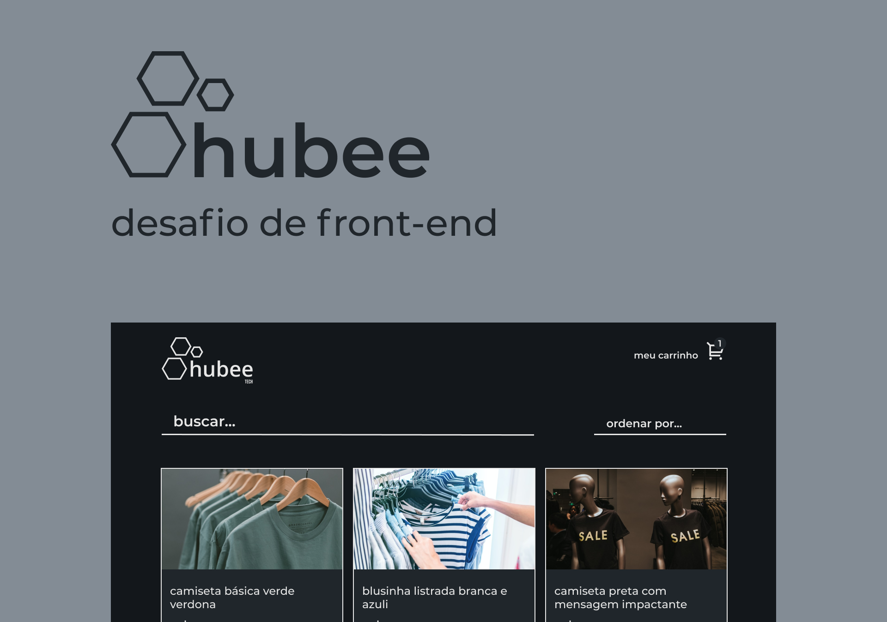

<h4 align="center">
    
    <br/>
</h4>

<p align="center">
  <br>

  

  <a href="https://www.linkedin.com/in/leonardo-thomaz/">
    
  </a>

  <a href="https://github.com/LMThomaz/hubee-frontend-challenge/commits/main">
    
  </a>
</p>

---

## :dart: Como funciona?

O projeto consiste em ser um catálogo de produtos, onde todo o contexto é controlado pelo carrinho.

Onde na tela inicial temos a listagem de todos produtos, onde é possível adicionar o produto ao carrinho, caso o mesmo já esteja, apenas será acrescentado na quantidade e também um filtro para áuxiliar, ainda na mesma página, há um link "meu carrinho" para que o usuário seja redirecionado para o seu carrinho.

Na tela do carrinho, será renderizado todos os items "adicionados" ao seu carrinho, juntamente com a quantidade, também tendo as funcionalidades de aumentar ou diminuir a quantidade de produto, e assim apresentando o valor unitário de cada produto juntamente com o montante da quantidade em relação ao valor do produto, e é possível deletar um produto do carrinho.

Ainda na tela do carrinho, temos mais algumas funcionalidades:

- Cupom: é possível inserir um cupom de desconto para a compra, onde é permitido apenas um e também é validade se o mesmo existe e esta válido.
- Finalização do pedido: é onde onde sua compra é finalizada, sendo enviado ao servidor, seu carrinho de comprar, com o identificador de cada produto, com o cupom e valor total. Ainda nessa funcionalidade é também criado um ordem de compra, onde é possível verificar de qual carrinho se trata e qual o status da compra.

## :notebook: Como foi desenvolvido?

Sendo ele desenvolvido utilizando [Redux][url-redux] e [Redux Saga][url-saga] para o controle do contexto, para o desenvolvimento do layout foi utilizado o [Styled Components][url-styled] para a organização do layout e [Material UI][url-mui] para os componentes mais "padrões".

Para manter uma harmonia no código, ou seja, um padrão. Foi utilizado o [ESLint][url-eslint] com o _code style_ do projeto [Airbnb][url-airbnb] mantido pela comunidade, juntamente com o [Prettier][url-prettier] para auxiliar no _auto save_ e para uma facilidade maior na compatibilidade entre os desenvolvedores também foi utilizado o [Editor Config][url-editor-config].

## :art: O layout?

O layout da aplicação foi construído baseado no protótipo disponível no [Figma][url-figma].


## :hammer: Ferramentas?

O projeto utiliza as seguintes ferramentas

- [React.js][url-react]
  - [React Icons][url-react-icons]
  - [React Toastify][url-react-toast]
  - [React Router DOM][url-react-router]
  - [TypeScript][url-ts]
- [Styled-components][url-styled]
- [Material UI][url-mui]
- [Axios][url-axios]
- [Redux][url-redux]
- [ESLint][url-eslint]
- [Prettier][url-prettier]
- [Editor Config][url-editor-config]

## :electric_plug: Como usar?

É **necessário** que tenha instalado em sua máquina:

- [Git][url-git]
- [Node][url-node]
- [Yarn][url-yarn] ou [npm][url-npm]
- [VSCode][url-vs]

### :package: Obter a aplicação

Baixe o [.zip][url-zip] do projeto ou faça o clone executando:

```bash
$ git clone https://github.com/LMThomaz/hubee-frontend-challenge
```

### :steam_locomotive: Instalar dependências

No diretório raiz da aplicação, abra o terminal e execute:

```bash
  # caso esteja usando yarn
  yarn
```

### :crystal_ball: Executar aplicação

#### :computer: Versão desenvolvimento

Após as dependências instaladas, execute:

```bash
  # para executar o front-end dá aplicação
  yarn start
```

---

## :coffee: Como posso ajudar?

1. Faça o Fork deste repositório
2. Comece uma branch com sua feature

```bash
$ git checkout -b minha-feature
```

3. Confirme (Commit) seus feitos

```bash
$ git commit -m 'Minha nova feature'
```

4. Suba (push) sua branch

```bash
$ git push origin minha-feature
```

---

<h4 align="center">
Feito com 💜 por <a href="https://www.linkedin.com/in/leonardo-thomaz/" target="_blank">Leonardo Thomaz</a>
</h4>

[url-ts]: https://www.typescriptlang.org/
[url-figma]: https://www.figma.com/file/VdKJMJu5hpHHHXPXl8rN8U/Hubee-Challenge?node-id=18%3A31
[url-axios]: https://github.com/axios/axios
[url-styled]: https://styled-components.com/docs
[url-mui]: https://material-ui.com
[url-zip]: https://github.com/LMThomaz/hubee-frontend-challenge/archive/main.zip
[url-node]: https://nodejs.org/
[url-react]: https://reactjs.org/
[url-redux]: https://redux.js.org
[url-saga]: https://redux-saga.js.org
[url-react-icons]: https://react-icons.github.io/react-icons/
[url-react-toast]: https://fkhadra.github.io/react-toastify/introduction
[url-react-router]: https://reactrouter.com/web/guides/quick-start
[url-eslint]: https://eslint.org
[url-prettier]: https://prettier.io
[url-editor-config]: https://editorconfig.org
[url-airbnb]: https://airbnb.io/javascript/react/
[url-git]: https://git-scm.com/
[url-vs]: https://code.visualstudio.com/
[url-npm]: https://www.npmjs.com/
[url-yarn]: https://yarnpkg.com/
